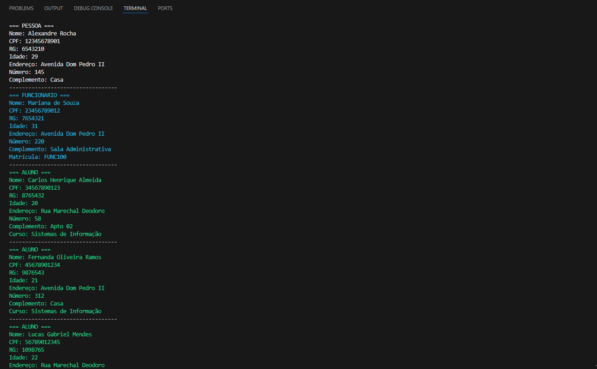

# 🎓 Sistema de Gestão Acadêmica (C#)

Projeto desenvolvido para a disciplina de Desenvolvimento de Sistemas, com foco em Programação Orientada a Objetos (POO), utilizando herança em C#.


## 📌 Objetivo

Implementar um sistema de cadastro acadêmico com diferentes tipos de pessoas, aplicando conceitos de herança e organização de código.


## 🧠 Conceitos aplicados

- Herança
- Encapsulamento
- Classes e Objetos
- Uso de List com polimorfismo


## 🏗️ Estrutura do projeto

### ClassesHeranca
Contém as classes principais:

- Pessoa
- Funcionario
- Aluno
- Professor
- Coordenador
- TecnicoAdministrativo
- Curso
- Logradouro


### AplicaçãoHerança

- Program.cs → execução do sistema
- GeradorDados.cs → criação dos dados
- ExibirDados.cs → exibição no console

## 👥 Cadastros realizados

- 1 Pessoa
- 1 Funcionário
- 3 Alunos
- 2 Professores
- 1 Coordenador
- 2 Técnicos Administrativos

Todos armazenados em:

List<Pessoa>


## ▶️ Como executar

### Pré-requisitos
- .NET instalado

### Executar o projeto

```
dotnet build
dotnet run --project .\AplicaçãoHerança\
```


## 🖥️ Saída

O sistema exibe:

- Tipo do objeto
- Dados pessoais
- Dados específicos de cada classe
- Cores diferentes no console para cada tipo
